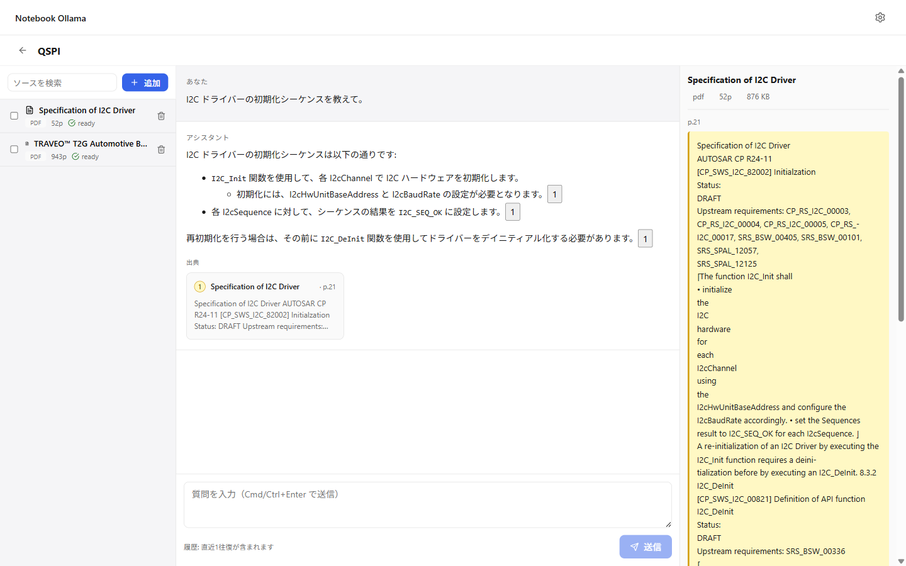
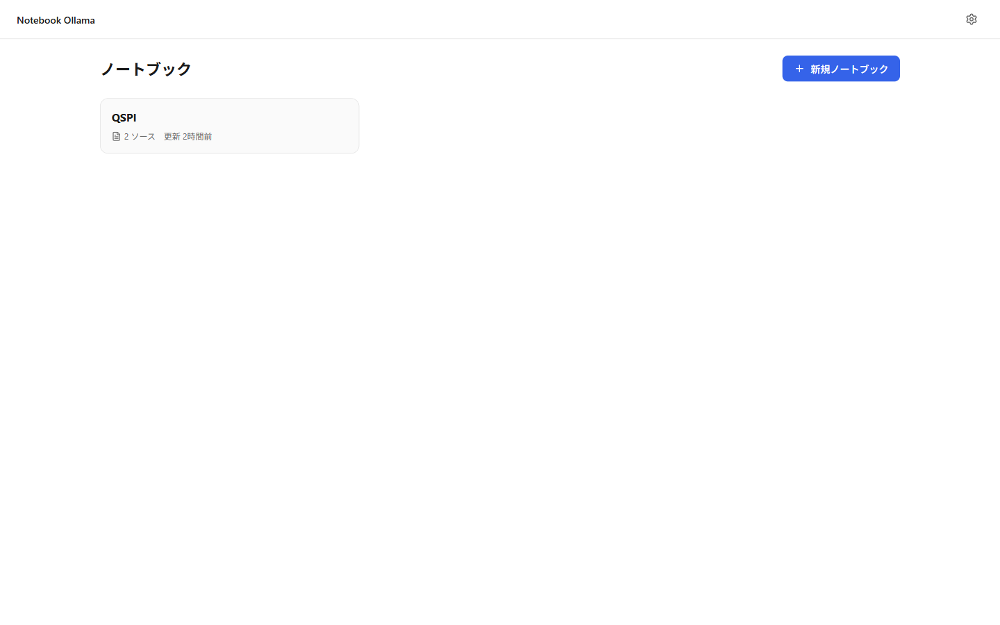
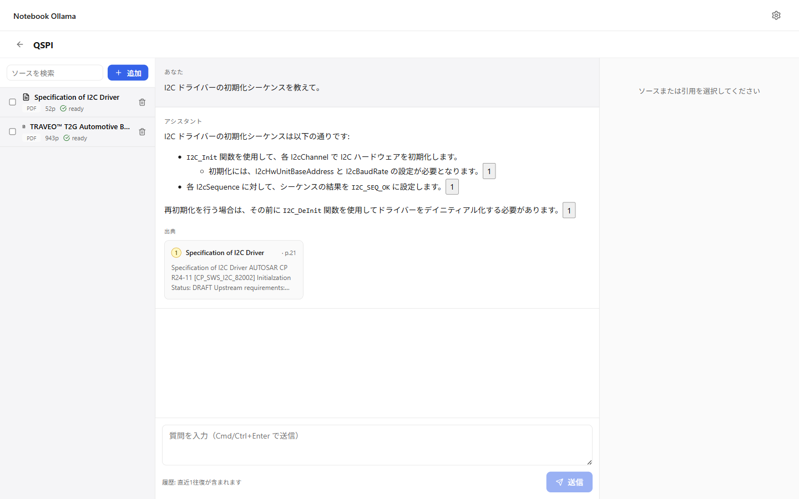
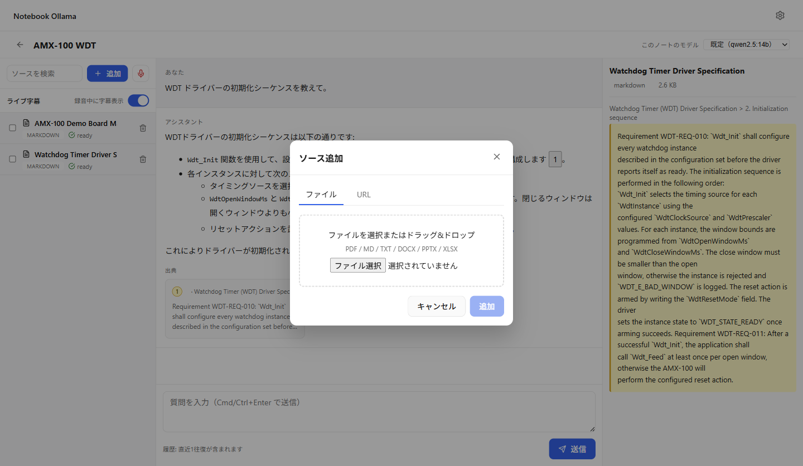
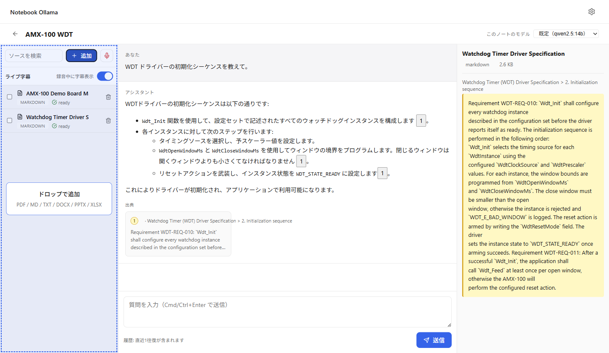
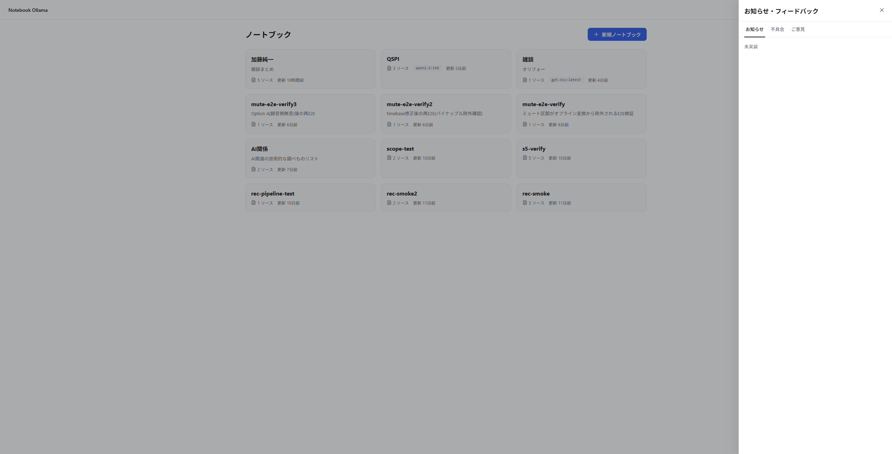

# Notebook Ollama

[](./LICENSE)


**ローカル完結**で動く NotebookLM ライクなパーソナルナレッジベース。  
Ollama を推論エンジン、Qdrant をベクトルストアとした **RAG** に加えて、**MCP サーバ**として他の LLM クライアントからも引用付き Q&A を呼べます。



## 何ができるか

- **ソース取り込み**: PDF / Markdown / TXT / DOCX / PPTX / XLSX / Web URL を投入
- **会議録音 → 文字起こし** (任意): マイク(あなた)+ システム音声(相手)を同時録音し、ライブ字幕を表示。停止後にオフラインで文字起こし・話者分離・話者名推定・整形・チャンク化・埋め込みまで自動処理してソース化（`uv sync --extra recording` で有効化、GPU 推奨）
- **引用付き Q&A**: 質問するとローカル LLM が回答 + 該当チャンクへのカード形式リンクを返す
- **3ペイン UI**: ソース一覧・チャット・ソースビューワを同時表示。引用カードクリックで該当ページの本文に即ジャンプ
- **OS 通知**: タブが非アクティブでも「回答完了」「取り込み完了」を OS 通知
- **進捗可視化**: 大型 PDF も `embedding (230/3629)` の形でリアルタイム進捗
- **MCP 公開**: Claude Desktop など他クライアントから `ask` / `find_quotes` / `list_models` などを呼べる
- **クラッシュレポート & お知らせ / フィードバックハブ**: 未捕捉例外を自動検知し、ユーザーが内容を目視確認・編集した上で GitHub Issue 起票URLをブラウザで開ける。ヘッダの拡声器アイコンから「お知らせ」「不具合報告」「ご意見・ご要望」も同じ Drawer に集約
- **完全ローカル**: ノートデータ・ベクトル・モデル推論すべて手元で完結。クラウド依存なし

## スクリーンショット

### ノートブック一覧


### 引用付きチャット（カード型 + クリックで該当チャンクへジャンプ）


### 出典カードから本文に飛ぶ


### ソース追加（モーダル）


### ドラッグ&ドロップ
パネルに直接ドロップで取り込み開始。  


## クラッシュレポート & お知らせ / フィードバックハブ

ヘッダ右端の歯車アイコンの左隣にある**拡声器 (Megaphone) アイコン**から、右側 Drawer (440px) を開いて「お知らせ」「不具合を報告」「ご意見・ご要望」の 3 タブを切り替えられます。アプリ内で未捕捉例外が発生した場合は即時モーダルでクラッシュが検知され、ハードウェア情報 (CPU / RAM / GPU) とスタックトレースを採取した上で**送信前にユーザー自身が内容を編集**して GitHub Issue 起票 URL をブラウザの別タブで開けます。`https://github.com/KawanoMomo/notebook-ollama/issues/new?title=&body=&labels=` のプリフィル形式なので PAT 埋め込みは不要、すべてユーザーの GitHub アカウントで完結します。



### オプトイン (有効化方法)

クラッシュレポート機能は**既定で無効**です。有効化するには次のいずれか:

- **設定画面から**: 設定 → 「クラッシュレポート」セクション → 「クラッシュレポート機能を有効にする」をオン
- **初回エラー時のダイアログから**: 最初のエラー発生時に `OptInDialog` が表示され、その場で同意するとオン

ホスト名・ファイルパス・RAG チャンク・ドキュメント本文は**ホワイトリスト方式で除外**され、収集対象は事前にプレビュー画面で確認できます (UI上で「送信される/されない」を一切宣言しないプライバシ合意モデル)。スタックトレースの SHA1 fingerprint で同一バグの重複起票を自動抑制します。

詳細設計: [`docs/specs/2026-06-28-crash-report-feedback-hub-design.md`](./docs/specs/2026-06-28-crash-report-feedback-hub-design.md)

## アーキテクチャ

```
┌──────────────────────────────────────────────────────────────┐
│  Browser (SvelteKit + Svelte 5)   :5173 (dev) / :8765 (prod) │
└──────────────────────────────────┬───────────────────────────┘
                                   │ HTTP / SSE
┌──────────────────────────────────▼───────────────────────────┐
│  FastAPI  (apps/api)                                          │
│  ├─ /api/notebooks, /sources, /conversations, /messages …    │
│  ├─ /api/notebooks/{id}/events  (SSE: 進捗・状態遷移)        │
│  └─ /mcp/*  (MCP SSE server, Bearer token 認証)              │
└──────────────────────────────────┬───────────────────────────┘
                                   │
                ┌──────────────────┼──────────────────┐
                ▼                  ▼                  ▼
        ┌──────────────┐  ┌──────────────┐  ┌──────────────┐
        │   SQLite     │  │   Qdrant     │  │   Ollama     │
        │  (metadata)  │  │  (vectors)   │  │  (LLM/Embed) │
        └──────────────┘  └──────────────┘  └──────────────┘
```

| レイヤ | 採用 |
|---|---|
| 推論 | Ollama (`qwen2.5:14b` など) |
| 埋め込み | Ollama `bge-m3` (1024次元) |
| ベクトル DB | Qdrant ローカルモード |
| メタデータ | SQLite |
| バックエンド | FastAPI (Python 3.12) |
| フロント | SvelteKit + Svelte 5 |
| MCP | Anthropic 公式 MCP SDK (`mcp[cli]`) |

詳細設計は [`docs/specs/notebook-ollama-design.md`](./docs/specs/notebook-ollama-design.md)。

## ライセンス

Notebook Ollama 本体は **MIT** で公開しています ([`LICENSE`](./LICENSE))。  
依存ライブラリのライセンスは [`LICENSE-THIRDPARTY.md`](./LICENSE-THIRDPARTY.md) を参照。

> **PDF 取り込みだけは opt-in 拡張**です。PDF パーサに使用する PyMuPDF は AGPL-3.0 のため、本体には同梱せず、利用者が同意付きスクリプトを実行したときのみ有効化します。  
> Markdown / TXT / DOCX / PPTX / XLSX / Web は本体だけで動きます。

## クイックスタート

### 1. 前提条件

| 必要なもの | Windows 11 | Linux | macOS |
|---|---|---|---|
| Ollama | [ollama.com/download](https://ollama.com/download) | 同左 | 同左 |
| Python 3.12 + `uv` | [docs.astral.sh/uv](https://docs.astral.sh/uv/getting-started/installation/) | 同左 | 同左 |
| Node.js 20+ | [nodejs.org](https://nodejs.org/) | 同左 | 同左 |

### 2. モデル取得 (初回のみ)

```bash
ollama pull qwen2.5:14b   # 約 9 GB
ollama pull bge-m3        # 約 1.2 GB
```

### 3. 起動

```bash
# 依存インストール
uv sync
cd apps/web && npm install && cd ../..

# API サーバ (--no-sync: 上の uv sync/uv sync --extra recording で入れた依存を
# 毎回の起動で勝手に消さないようにする。scripts/start.ps1・start.sh・dev.ps1・dev.sh も同様)
uv run --no-sync uvicorn apps.api.main:app --port 8765
# 別ターミナルで dev UI
cd apps/web && npm run dev   # http://localhost:5173
```

### 4. PDF サポート (任意)

```bash
# Linux / macOS
bash scripts/install-pdf-support.sh

# Windows PowerShell
pwsh scripts/install-pdf-support.ps1
```

AGPL-3.0 の同意プロンプトに `y` で答えると PyMuPDF が `uv sync --extra pdf` でインストールされます。

### 5. 録音サポート (任意・GPU 推奨)

会議録音と文字起こしを使う場合は、録音用の依存（faster-whisper / 話者分離 / CUDA ランタイム等。やや大きめ）を追加します。

```bash
uv sync --extra recording
```

- マイク + システム音声（ループバック）の**同時録音**と**ライブ字幕**
- 停止後に**オフラインで** STT・話者分離・話者名推定・LLM 整形・チャンク化・埋め込み
- 話者は「あなた」（マイク）/「相手1…」（システム）として記録され、チップから**リネーム**可能
- NVIDIA GPU（CUDA）推奨。録音依存が未導入のままでも API サーバ・取り込み・チャットは通常通り起動しますが、録音系エンドポイント (`/api/notebooks/{id}/recordings*`) は HTTP 503 を返し、UI 側では録音ボタンが失敗します（`uv sync --extra recording` で解消）。
- `uv sync --extra recording` は一度実行すれば十分です。付属の起動スクリプト（`start.ps1` / `start.sh` / `dev.ps1` / `dev.sh`）は `uv run --no-sync` で起動するため、次回以降の起動でこの依存が勝手に外れることはありません。
- **注意**: これらのスクリプトを経由せず、後日 **素の `uv sync`（`--extra` を付けない）** を再実行すると、以前入れた `recording` / `pdf` extra は静かにアンインストールされます（`git pull` 後の「依存を更新しよう」で踏みがちです）。全部まとめて維持したい場合は `uv sync --all-extras` を使ってください。

### 視覚埋め込み (任意, Stage 3/4)

PDF ページを画像のまま検索する視覚インデックス機能。

```bash
uv sync --extra visual
```

GPU (NVIDIA) を使う場合、`pyproject.toml` の `[[tool.uv.index]]` が
`download.pytorch.org/whl/cu130` を指しているため CUDA 版 torch が入る。
CUDA が使えない環境では自動的に CPU 実行へフォールバックする(1ページ
あたり 1〜2 分かかる)。

```bash
uv run --no-sync python -c "import torch; print(torch.cuda.is_available(), torch.cuda.get_arch_list())"
```

## Windows: PowerShell 実行ポリシーについて

`scripts\*.ps1` を実行したとき、次のようなエラーが出ることがあります。

```
このシステムではスクリプトの実行が無効になっているため…
FullyQualifiedErrorId : UnauthorizedAccess
```

Windows の既定 `Restricted` ポリシーが `.ps1` の直接実行をブロックしているためです。3 通りの対処があります。

### ① 都度バイパス（恒久設定を変えたくないとき）

```powershell
powershell -ExecutionPolicy Bypass -File .\scripts\start.ps1 -OpenBrowser
```

レジストリを変更せず、そのプロセス内だけポリシーを上書きします。会社規定の影響を最小化したい場合の第一選択。

### ② 現在のセッションだけ許可

```powershell
Set-ExecutionPolicy -Scope Process -ExecutionPolicy Bypass
.\scripts\start.ps1 -OpenBrowser
```

ウィンドウを閉じたら元に戻ります。

### ③ ユーザースコープで恒久的に許可（管理者権限不要）

```powershell
Set-ExecutionPolicy -Scope CurrentUser -ExecutionPolicy RemoteSigned
```

- ローカル作成の `.ps1` は無条件実行可能
- インターネットからダウンロードした `.ps1` は署名がないと実行不可（一定のセキュリティを維持）
- 個人 PC / 制限のない開発環境向け

### 会社・規制環境での注意

恒久変更（③）の前に、Group Policy で上書きされていないかを確認してください。

```powershell
Get-ExecutionPolicy -List
```

- `MachinePolicy` / `UserPolicy` が `Restricted` や `AllSigned` の場合は GPO で強制されており、`CurrentUser` を変更しても無効化されます。IT 部門への申請が必要、または社内規定違反になり得ます。
- AppLocker / WDAC / EDR (Defender for Endpoint, CrowdStrike 等) が有効な環境では、ポリシー以前にスクリプト実行自体がブロックまたはログ収集対象になります。
- 不明な場合は **①の都度バイパス方式**が最も無難です。

なお、`scripts\install-startup.ps1` がタスクスケジューラに登録する起動コマンドには `-ExecutionPolicy Bypass` が既に組み込まれているため、ログオン時自動起動はポリシー変更なしでも動作します。

## トラブルシューティング

### 大型モデル(GPT-OSS:20B 等)で「ネットワークエラー」が出る

Ollama がモデルをロードしている間に HTTP タイムアウト(既定 600 秒)が切れている可能性があります。RTX 2080 Ti (VRAM 11 GB) など VRAM が小さい GPU では、20B モデルは CPU/GPU 分割ロードになり初回ロードに数分かかります。

対策(優先順):

1. **モデルを事前ロードして常駐させる**(推奨・追加コストなし)

   別ターミナルで一度ロードしておくと、Notebook Ollama からの呼び出しは即時応答します。

   ```powershell
   ollama run gpt-oss:20b ""
   ```

   既定では 5 分間アイドルでアンロードされます。長く常駐させたい場合は `OLLAMA_KEEP_ALIVE=24h` を `ollama serve` の環境変数に指定してください。

2. **設定 UI でタイムアウトを延ばす**

   `設定 → モデル・Ollama → タイムアウト` で `request_timeout` と `chat_read_timeout` を 1200 (秒) 等に変更し保存。`settings.json` に永続化されます。

3. **環境変数で起動時から伸ばす**(自動起動・サーバ運用向け)

   PowerShell:

   ```powershell
   $env:NOTEBOOK_OLLAMA_OLLAMA__REQUEST_TIMEOUT_SECONDS = "1200"
   $env:NOTEBOOK_OLLAMA_OLLAMA__CHAT_READ_TIMEOUT_SECONDS = "1200"
   .\scripts\start.ps1
   ```

   Bash:

   ```bash
   export NOTEBOOK_OLLAMA_OLLAMA__REQUEST_TIMEOUT_SECONDS=1200
   export NOTEBOOK_OLLAMA_OLLAMA__CHAT_READ_TIMEOUT_SECONDS=1200
   ./scripts/start.sh
   ```

## 本番ビルド

```bash
cd apps/web && npm run build   # → apps/web/dist/
cd ../..
uv run --no-sync uvicorn apps.api.main:app --port 8765
# UI + API を同じ :8765 で提供
```

## MCP サーバとして使う

起動時に `~/.notebook-ollama/mcp.token` が生成されます。Claude Desktop 等から:

```json
{
  "mcpServers": {
    "notebook-ollama": {
      "url": "http://localhost:8765/mcp/sse",
      "headers": { "Authorization": "Bearer <内容を貼り付け>" }
    }
  }
}
```

公開ツール: `ask` / `find_quotes` / `list_notebooks` / `list_models` / `get_source_outline`

## 開発

```bash
uv run pytest                 # ユニット + 統合 (Ollama 不要)
uv run pytest -m ollama       # Ollama 必要なテスト
cd apps/web && npm run check  # 型チェック
cd apps/web && npm run test:unit
```

レイアウト:

- `core/` — ドメインロジック (FastAPI 非依存)
- `apps/api/` — FastAPI ルータ / スキーマ
- `apps/web/` — SvelteKit フロント
- `tests/unit` `tests/integration` `tests/mcp` — テスト分離

## ライセンス

[MIT](./LICENSE) — Copyright (c) 2026 Kawano Momo
