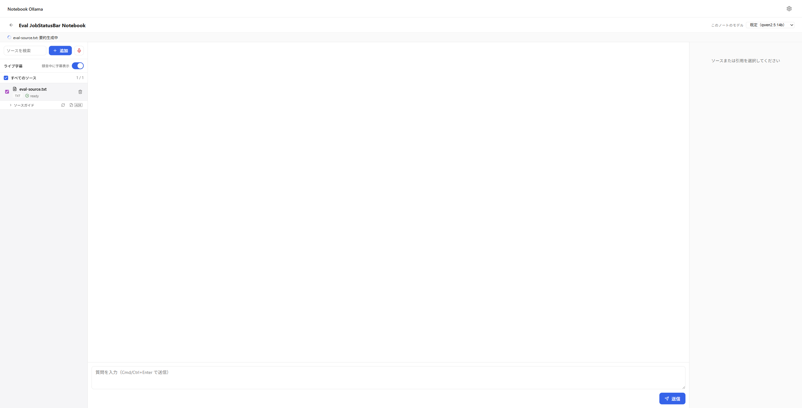
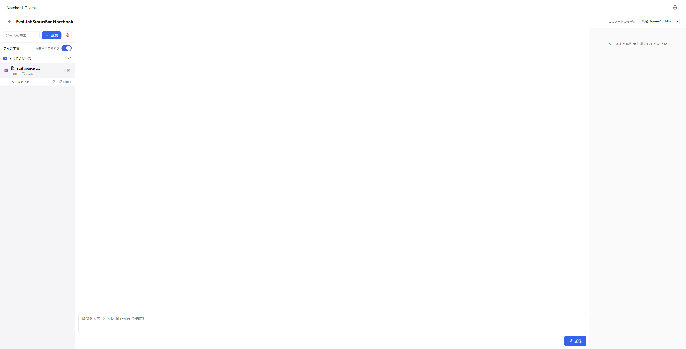
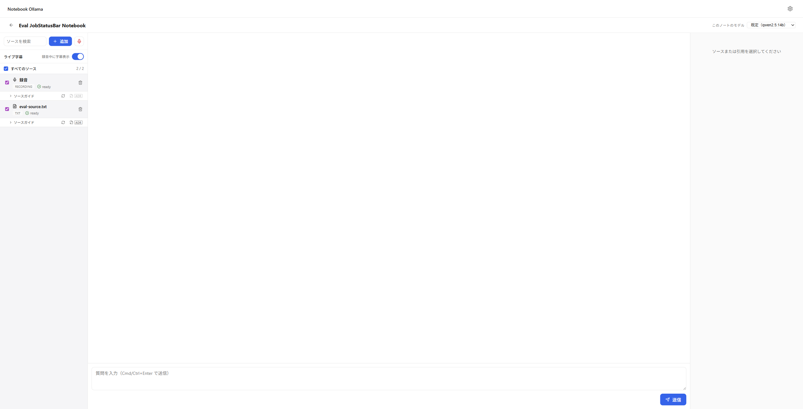
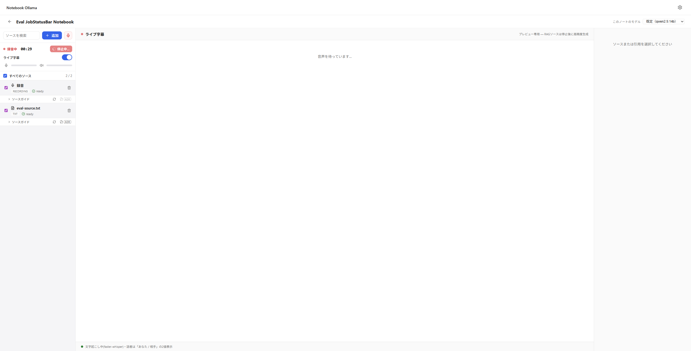
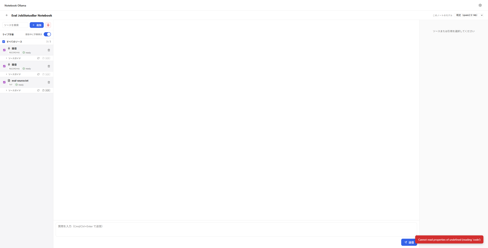

# Playwright 実機検証レポート — JobStatusBar + 録音ボタン optimistic UI

- 対象: http://127.0.0.1:8766/ (検証専用の分離データディレクトリ + ポート)
- Spec: `docs/specs/2026-07-02-job-status-bar-optimistic-ui-design.md`
- 実行日時: 2026-07-02 08:33〜08:41 (JST)
- 判定: **PASS (5/5)**。ただし AC5 で副次的な既存バグを検出(詳細は末尾「検出した副次バグ」参照。プラン外につき本ブランチでは未対応、別 follow-up として起票予定)

## 準備

新規ノートブック「Eval JobStatusBar Notebook」(`01KWG0H1NYZPD6DY2QWXB1F5AB`) を作成し、日本語テキストファイル `eval-source.txt` をアップロード。取り込み完了後、自動的に要約生成ジョブが開始された。

## 項目別判定

### 1. 要約生成中のステータスバー表示 — PASS

topbar 直下に「eval-source.txt: 要約生成中」のラベル + スピナーを含むバーを確認(DOM上 `role=status`)。



### 2. 完了後にバーが消える — PASS

約15秒後、ステータスバー消失。ソース側も緑チェック付き「ready」のみ。console.error 0件。



### 3. 録音開始ボタンの即時反応 — PASS

無遅延の初回試行ではローカル dev サーバの応答が速すぎて、クリック→スクリーンショットの往復(MCPラウンドトリップ)の間に開始APIが完了してしまい、「録音中00:01」の完了後UIしか撮れなかった(`03-record-button-immediate-after-click.png`、参考)。

`browser_evaluate` で `window.fetch` をパッチし、開始APIにのみ3秒の人工遅延を注入して再実行した結果、クリック直後に**録音ボタンが disabled 化しアイコンがスピナーに置き換わる状態**を確定的に捕捉(スナップショットでも `button "録音" [disabled]` を確認)。


### 4. 録音停止ボタンの即時反応 — PASS(録音開始が実際に成功したため実施)

同様に停止APIにのみ3秒遅延を注入したところ、停止ボタンのラベルが**「停止中…」+ スピナー + disabled**へ確実に変化することを確認。遅延解除後は正しく録音停止・新規ソース追加まで完了。




### 5. 録音API失敗時のロールバック — PASS(機能要件は満たすがUXバグを検出)

Playwright専用の route interception ツールが提供されていなかったため、`browser_evaluate` で `window.fetch` を上書きし、開始エンドポイントに対し常に `500` + FastAPI標準の `{"detail": "..."}` ボディを返すよう固定。

- (a) 一時的disabled+スピナー化: AC3/AC4と同一コードパスのため発生
- (b) 失敗後、disabled解除・通常の赤いマイクアイコンに復帰(余分なソースも残留せず)
- (c) 赤いエラートーストが表示された。ただし文言が生のJS例外メッセージ `Cannot read properties of undefined (reading 'code')` であり、ユーザー向けの説明文になっていない(詳細は下記)
- console.error としては記録されておらず、トースト表示ロジック内で例外を握りつぶし `.message` をそのまま表示していると推測される
- 3秒後トーストは自動消滅、UIは録音開始前の状態に完全復帰




## メトリクス

- console.error 件数: 0
- network 失敗件数: 0 (AC5の500はJS内モック応答のためPlaywrightのネットワークログには現れない仕様上の制約。それ以外の全リクエストは2xx/202)

## 検出した副次バグ(プラン外、follow-up 起票予定)

`apps/web/src/lib/api/client.ts` の `request()` が、エラーレスポンスは常に `{error: {code, message, detail, remediation}}` の形(バックエンドの `AppError` 用グローバル例外ハンドラ `apps/api/main.py:106-107` が返す形)だと無条件に仮定している:

```typescript
if (isJson) {
  const body = (await response.json()) as ErrorResponse;
  const err = body.error;
  throw new ApiError(err.code, response.status, err.message, err.detail, err.remediation);
}
```

`AppError` を経由しない生の `HTTPException` / バリデーションエラー / 未処理例外の場合、FastAPI は `{"detail": "..."}` 形式で返すため `body.error` が `undefined` となり、`err.code` へのアクセスで `TypeError: Cannot read properties of undefined (reading 'code')` が発生し、その例外メッセージがそのままユーザー向けトーストに漏れる。

このブランチの4タスク(events.svelte.ts / currentNotebook.svelte.ts / JobStatusBar.svelte / recording.svelte.ts)はいずれもこのファイルに触れておらず、**既存の共通基盤コードの pre-existing バグ**と判断。ユーザー判断により、本ブランチでは対応せず別 issue として起票する。
